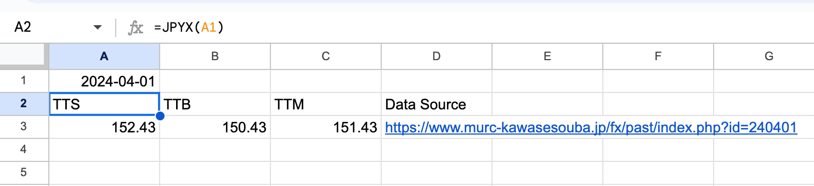

# JPYX GAS

This project provides the functions `JPYX` and `JPYXLASTMONTH` to show USD/JPY (JPY=X) on your Google Sheets.



# Installation

[clasp](https://github.com/google/clasp) allows you to install the functions easily as follows:

```
npm install
npm run clasp login
npm run clasp create -- --parentId <sheet-id>
npm run deploy
```

The sheet ID is included in the seet URL: `https://docs.google.com/spreadsheets/d/<sheet-id>/edit`.
You can create a new sheet with `npm run clasp create -- --type sheets` instead of `npm run clasp create -- --parentId <sheet-id>`.
